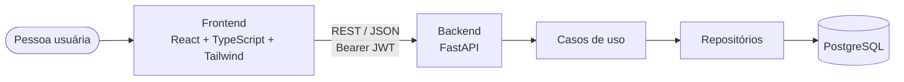

<div align="center">

# 📚 Estante

**Organize livros, mangás e quadrinhos em um só lugar.**
Cadastre obras, busque na estante e monte suas listas de leitura.


Projeto da disciplina **Laboratório de Engenharia de Software** · Fatec São José dos Campos · Prof. Juan Hassan

</div>

---

## ✨ O que dá para fazer

| Tela | Rota | O que acontece |
| --- | --- | --- |
| 🏠 **Início** | `/` | Apresentação do app e atalhos para a estante |
| 🔑 **Login** | `/login` | Entra com e-mail e senha (JWT) e volta para onde você estava |
| 📝 **Cadastro** | `/cadastro` | Cria a conta e já entra logada |
| 🗂️ **Estante** | `/livros` | Grade de capas, busca por título/autor e filtros de Mangás e Quadrinhos |
| 📖 **Detalhe da obra** | `/livros/:id` | Autores, editora, ISBN, gêneros e temas |
| ➕ **Cadastrar obra** | `/livros/novo` | Formulário de livro, mangá ou quadrinho *(requer login)* |
| 🧺 **Minhas listas** | `/listas` | Cria listas (públicas ou privadas) e vê todas as suas *(requer login)* |
| 📑 **Detalhe da lista** | `/listas/:id` | Obras da lista e adição de novas obras *(requer login)* |

> 🎨 **Visual:** minimalista, inspirado no Skoob — fundo creme (`#FAF5EA`), azul de tom quente (`#3A5F8A`), títulos em *Lora* e texto em *Inter*.

## 🚀 Começando rápido

Você precisa de **Python 3.14 + [uv](https://docs.astral.sh/uv/)** e **Node 22+**.

```bash
# 1. API  → http://localhost:8000  (documentação interativa em /docs)
cd backend
cp .env.example .env
uv sync
uv run uvicorn src.presentation.api.main:app --reload --env-file .env
```

```bash
# 2. Frontend  → http://localhost:5173
cd frontend
cp .env.example .env
npm install
npm run dev
```

Pronto: crie uma conta em `/cadastro` e cadastre sua primeira obra. Mais detalhes (Docker, migrations, testes) no [**Manual de Execução**](docs/MANUAL_EXECUCAO.md).

## 🧱 Como tudo se conecta



O backend segue **Clean Architecture / DDD**. A explicação completa, com diagrama de camadas e os design patterns usados, está em [**docs/ARQUITETURA.md**](docs/ARQUITETURA.md).

## 🗺️ Estrutura do repositório

```text
.
├── backend/            # API FastAPI (domain → application → infrastructure → presentation)
│   ├── src/
│   ├── tests/          # pytest (unitários e de API)
│   └── alembic/        # migrations
├── frontend/           # React + Vite + Tailwind
│   └── src/            # pages, components, auth, lib, testes (*.test.ts[x])
├── docs/               # especificação, arquitetura, modelagem e manual
└── img/der.png         # Diagrama Entidade-Relacionamento
```

## 📋 Entregáveis do projeto

| Entregável | Situação | Onde |
| --- | --- | --- |
| **Backend Python** (FastAPI, REST limpa e tratada) | ✅ | [`backend/`](backend/) · erros mapeados para 401/403/404/409/422 |
| **Design Patterns** (mínimo de 2) | ✅ Repository, Data Mapper, Dependency Injection | [Arquitetura](docs/ARQUITETURA.md#design-patterns) |
| **Frontend React** (TypeScript) | ✅ | [`frontend/`](frontend/) |
| **Repositório Git** (commits, branches, PRs, README) | ✅ branches por funcionalidade + Conventional Commits | este repositório |
| **Banco relacional** (PostgreSQL, sem SQLite) | 🟡 PostgreSQL configurado; persistência da API ainda em transição | [Pendências](docs/MANUAL_EXECUCAO.md#pendencias-conhecidas) |
| **Modelagem de dados** (DER) | ✅ | [Modelagem](docs/MODELAGEM_DADOS.md) · [`img/der.png`](img/der.png) |
| **Desenho de arquitetura** (React + Python + BD) | ✅ | [Arquitetura](docs/ARQUITETURA.md) |
| **Documentação técnica** (RFs, RNFs, manual de execução) | ✅ | [Especificação](docs/ESPECIFICACAO.md) · [Manual](docs/MANUAL_EXECUCAO.md) |

## 🌿 Fluxo de trabalho

Cada funcionalidade nasce em uma branch própria a partir de `develop` e entra por Pull Request. Commits seguem o padrão `tipo(escopo): descrição` (`feat`, `fix`, `docs`, `test`, `chore`).

## 📚 Documentação

- [Especificação (RFs, RNFs, regras e rotas)](docs/ESPECIFICACAO.md)
- [Arquitetura e design patterns](docs/ARQUITETURA.md)
- [Modelagem de dados (DER)](docs/MODELAGEM_DADOS.md)
- [Estratégia de testes](docs/TESTES.md)
- [Manual de execução](docs/MANUAL_EXECUCAO.md)
- [README do backend](backend/README.md) · [README do frontend](frontend/README.md)
