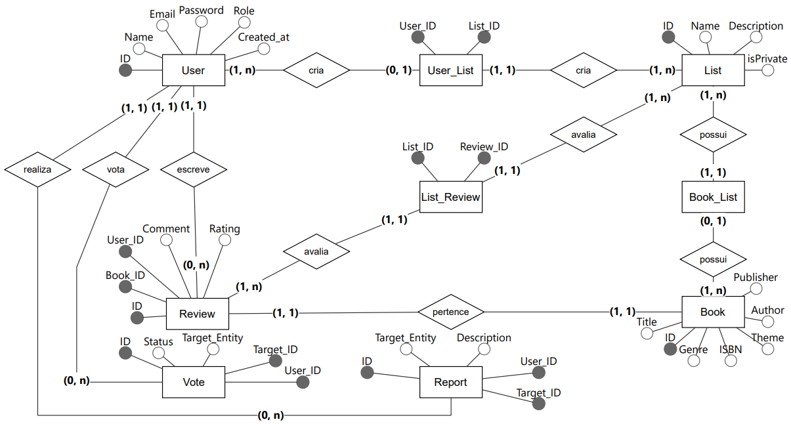

# Servidor do projeto books

API provedora de serviços para a aplicação, desenvolvida em FastAPI seguindo os critérios fornecidos pelo professor Juan Hassan da disciplina Laboratório de Engenharia de Software pela Fatec de São José dos Campos.

## Sumário
- [Como Executar](#how_to_run)
- [Arquitetura da Aplicação](#app_architecture)
- [Diagrama de Entidade e Relacionamento](#der)
- [Rotas da Aplicação](#app_route)
- [Tecnologias Utilizadas](#technology)

##  ❓ Como Executar 
- Instruções de execução

##  Arquitetura da aplicação 
- Estrutura de diretórios e suas funções

##  Diagrama de Entidade e Relacionamento (DER) 

### Entidades
- User (Usuário do sistema)
  - ID (Identificador único) - Gerado automaticamente
  - Name (Nome) - Obrigatório
  - Email (Email) - Obrigatório
  - Password (Senha) - Obrigatório
  - Role (Comum, Desenvolvedor, Admin) - Apenas um admin pode modificar
  - Created_at (Data de criação) - Gerado automaticamente
- Book (Livros)
  - ID (Identificador único) - Gerado automaticamente
  - ISBN (ISBN do livro) - Opcional (um livro pode não ter o ISBN)
  - Genre (Gênero) - Multivalorado obrigatório
  - Theme (Tema) - Multivalorado obrigatório
  - Title (Título) - Obrigatório
  - Author (Autor) - Multivalorado obrigatório
  - Publisher (Editora) - Obrigatório
- List (Uma lista de livros criada pelo usuário)
  - ID (Identificador único) - Gerado automaticamente
  - Name (Nome) - Obrigatório
  - Description (Descrição breve) - Opcional
  - isPrivate (Indica se a lista é privada) - Opcional
- Review (Review de algum livro)
  - ID (Identificador único) - Gerado automaticamente
  - User_ID (ID do Usuário) - O front passa automaticamente
  - Book_ID (ID do Livro) - O front passa automaticamente
  - Comment (Comentário) - Opcional
  - Rating (Avaliação em estrelas) - Obrigatório (vai de 1 a 5)
- Vote (O usuário pode dar like/dislike ou adicionar marcações para livros)
  - ID (Identificador único) - Gerado automaticamente
  - User_ID (ID do Usuário) - O front passa automaticamente
  - Target_ID (ID do Alvo) - O front passa automaticamente
  - Target_Entity (Entidade do alvo) - O front passa automaticamente
  - Status (Indica o conteúdo do voto) - Obrigatório
- Report (O usuário pode reportar algum conteúdo)
  - ID (Identificador único) - Gerado automaticamente
  - User_ID (ID do Usuário) - O front passa automaticamente
  - Target_ID (ID do Alvo) - O front passa automaticamente
  - Target_Entity (Entidade do alvo) - O front passa automaticamente
  - Description (Descrição do motivo da denúncia) - Obrigatório

##  ↪️ Rotas da Aplicação 
- /

##  💻 Tecnologias Utilizadas 
- Backend

- Database

- Tests

- DevOps
