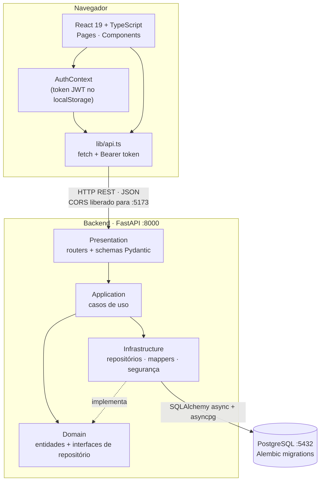
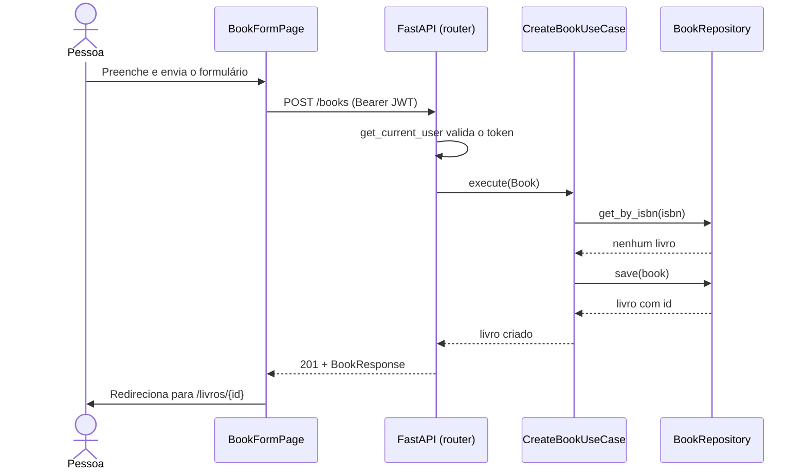

# Arquitetura

## Sumário

- [Visão de integração](#visão-de-integração-react--python--banco)
- [Camadas do backend](#camadas-do-backend)
- [Design Patterns](#design-patterns)
- [Frontend](#frontend)
- [Fluxo de uma requisição](#fluxo-de-uma-requisição)

## Visão de integração (React + Python + Banco)



| Parte | Tecnologia | Porta |
| --- | --- | --- |
| Frontend | React 19, TypeScript, Vite, Tailwind 4, React Router | `5173` |
| Backend | Python 3.14, FastAPI, Pydantic, PyJWT, bcrypt | `8000` |
| Banco | PostgreSQL, SQLAlchemy 2 (async), Alembic | `5432` |

## Camadas do backend

A regra de dependência aponta sempre **para dentro**: `presentation → application → domain`, e a `infrastructure` implementa as interfaces definidas no `domain`.

```text
backend/src/
├── domain/            # Núcleo: entidades (Book, BookList, User), exceções e interfaces de repositório
├── application/       # Casos de uso (CreateBook, SearchBooks, AuthenticateUser, AddBookToList…)
├── infrastructure/    # Repositórios (memória e SQLAlchemy), mappers, hash de senha, JWT
├── presentation/      # FastAPI: routers, schemas Pydantic, dependências (usuário logado)
└── core/              # Configurações lidas do ambiente
```

| Camada | Conhece | Responsabilidade |
| --- | --- | --- |
| `domain` | Nada externo | Regras e invariantes (ex.: ISBN ≥ 10 caracteres) |
| `application` | `domain` | Orquestra uma ação do usuário (ex.: impedir ISBN duplicado) |
| `infrastructure` | `domain` | Detalhes técnicos: banco, bcrypt, JWT |
| `presentation` | `application`, `domain` | HTTP: valida entrada, chama o caso de uso, traduz erros em status |

## Design Patterns

### 1. Repository

Isola o acesso a dados atrás de uma interface do domínio. Os casos de uso dependem da abstração, nunca do banco.

- Interfaces: [`BookRepository`](../backend/src/domain/repositories/book_repository.py), `UserRepository`, `BookListRepository`
- Implementações: `InMemoryBookRepository` (testes e desenvolvimento) e `SQLAlchemyRepository` (PostgreSQL)

```python
class SearchBooksUseCase:
    def __init__(self, book_repository: BookRepository):  # abstração, não o banco
        self.book_repository = book_repository
```

Benefício: os testes de casos de uso rodam sem banco, e trocar a persistência não altera regra de negócio.

### 2. Data Mapper

[`BookMapper`](../backend/src/infrastructure/persistence/mappers/book_mapper.py) converte entre a **entidade de domínio** (`dataclass`) e o **modelo SQLAlchemy**, mantendo o domínio livre de ORM.

```python
BookMapper.to_sqlalchemy(book)   # domínio → tabela
BookMapper.to_domain(db_model)   # tabela  → domínio
```

### 3. Dependency Injection

O `Depends` do FastAPI injeta repositório e usuário logado nos endpoints, e os testes de API trocam as implementações com `app.dependency_overrides`.

```python
async def create_book(
    payload: CreateBookSchema,
    repository: BookRepository = Depends(get_book_m_repository),
    _current_user: User = Depends(get_current_user),
): ...
```

### Também presentes

- **Use Case (Application Service):** uma classe por ação do usuário, com um único método `execute`.
- **Exceções de domínio:** hierarquia a partir de `DomainError`, traduzida para status HTTP na camada de apresentação.

## Frontend

```text
frontend/src/
├── pages/        # Uma tela por arquivo (Login, Cadastro, Catálogo, Detalhe, Listas…)
├── components/   # Layout, Navbar, BookCard e primitivos de UI (Button, Field, Card, Alert)
├── auth/         # AuthContext (sessão) e ProtectedRoute (rotas que exigem login)
└── lib/          # Cliente HTTP, tipos da API e helpers de obras
```

- **Estado de sessão:** `AuthProvider` guarda o usuário e restaura a sessão chamando `/auth/me` com o token salvo.
- **Rotas protegidas:** `ProtectedRoute` redireciona para `/login` e devolve a pessoa à página original após entrar.
- **Cliente HTTP:** `api()` injeta o `Authorization`, converte erros do FastAPI em mensagens legíveis e suporta cancelamento.

## Fluxo de uma requisição

Exemplo: cadastrar uma obra.


