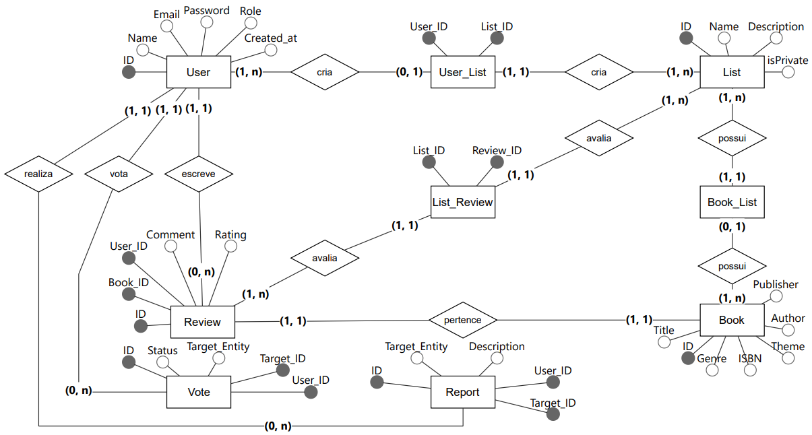
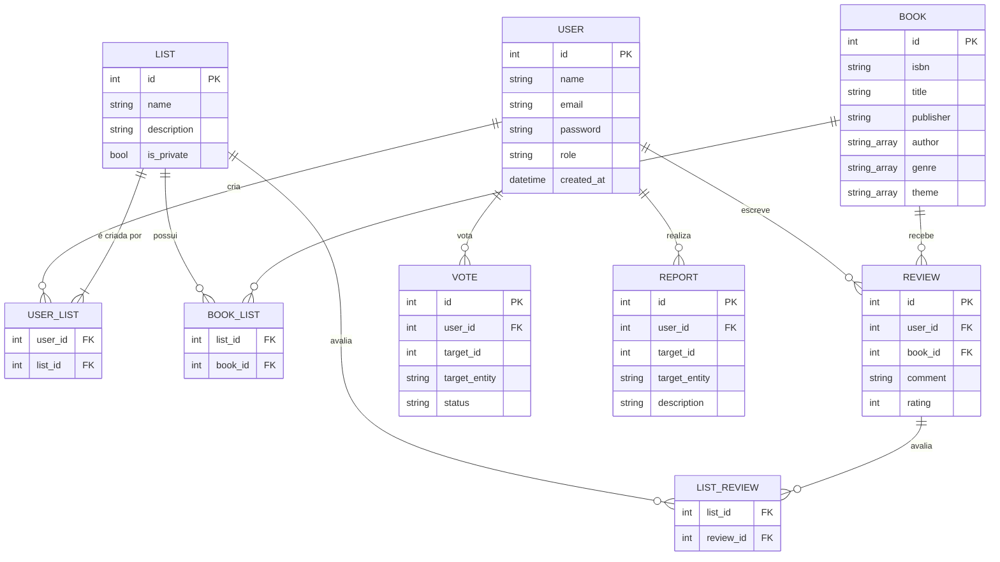

# Modelagem de Dados

## Diagrama Entidade-Relacionamento (DER)

Versão textual do mesmo modelo, renderizada pelo GitHub:

## Entidades

| Entidade | Descrição | Campos principais |
| --- | --- | --- |
| **User** | Pessoa usuária do sistema | `id`, `name`, `email`, `password` (hash), `role` (comum, desenvolvedor, admin), `created_at` |
| **Book** | Livro, mangá ou quadrinho | `id`, `isbn`, `title`, `publisher`, `author` (multivalorado), `genre` (multivalorado), `theme` (multivalorado) |
| **List** | Lista de obras criada por um usuário | `id`, `name`, `description`, `is_private` |
| **Review** | Avaliação de uma obra | `id`, `user_id`, `book_id`, `comment` (opcional), `rating` (1 a 5) |
| **Vote** | Like/dislike ou marcação em um conteúdo | `id`, `user_id`, `target_id`, `target_entity`, `status` |
| **Report** | Denúncia de conteúdo | `id`, `user_id`, `target_id`, `target_entity`, `description` |
| **User_List**, **Book_List**, **List_Review** | Tabelas associativas (N:N) | chaves estrangeiras das entidades relacionadas |

## Como o DER aparece no código

| Entidade | Entidade de domínio | Tabela (Alembic/SQLAlchemy) | Exposta na API |
| --- | --- | --- | --- |
| User | ✅ `domain/entities/user.py` | 🔜 | ✅ `/auth/*` |
| Book | ✅ `domain/entities/book.py` | ✅ `books`, `authors`, `book_author` | ✅ `/books` |
| List | ✅ `domain/entities/book_list.py` | 🔜 | ✅ `/lists` |
| Review / Vote / Report | 🔜 | 🔜 | 🔜 |

> Na implementação atual, o autor é normalizado em uma tabela própria (`authors`) ligada a `books` por `book_author`; gênero e tema ainda não têm tabela.
