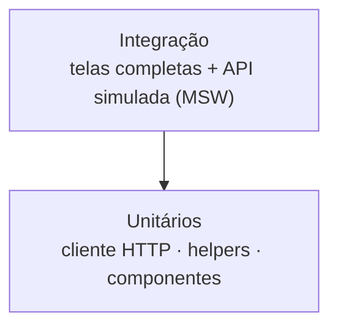

# Estratégia de Testes

## Sumário

- [Visão geral](#visão-geral)
- [Backend](#backend)
- [Frontend](#frontend)
- [O que os testes de integração cobrem](#o-que-os-testes-de-integração-cobrem)
- [Como escrever um novo teste de tela](#como-escrever-um-novo-teste-de-tela)
- [Formatação com Prettier](#formatação-com-prettier)

## Visão geral



| Camada | Backend | Frontend |
| --- | --- | --- |
| Unitário | Entidades, casos de uso e mappers | Cliente HTTP, helpers e componentes de UI |
| Integração | Rotas FastAPI com `TestClient` | Páginas e rotas renderizadas com API simulada |
| Ferramentas | `pytest`, `pytest-asyncio` | `Vitest`, `Testing Library`, `user-event`, `MSW`, `jsdom` |

## Backend

```bash
cd backend
uv run pytest
```

- Testes unitários em `tests/unit/{domain,application,infrastructure}`.
- Testes de API em `tests/unit/presentation`, usando `app.dependency_overrides` para trocar os repositórios por versões em memória isoladas por teste (`conftest.py`).

## Frontend

```bash
cd frontend
npm test                 # uma execução
npm run test:watch       # modo observação
npm run test:coverage    # relatório de cobertura
```

| Arquivo | Tipo | Cobre |
| --- | --- | --- |
| `src/lib/api.test.ts` | Unitário | Token Bearer, JSON, erros de `detail` (texto e lista do Pydantic), falha de rede, cancelamento |
| `src/lib/books.test.ts` | Unitário | `kindOf` (tipo da obra) e `splitList` |
| `src/components/ui.test.tsx` | Unitário | `Button`, `Field` (rótulo e dica acessíveis), `Card`, `Alert` |
| `src/components/BookCard.test.tsx` | Unitário | Card e capa da obra |
| `src/integration/auth.test.tsx` | Integração | Login, cadastro, sessão, logout e rotas protegidas |
| `src/integration/books.test.tsx` | Integração | Estante (busca e filtro), detalhe da obra e cadastro de obra |
| `src/integration/lists.test.tsx` | Integração | Minhas listas e detalhe da lista |

### Como a API é simulada

O MSW intercepta as requisições `fetch` no nível de rede, então o código de produção roda sem alterações (inclusive o `api()` e o `AuthProvider`). Em `src/test/setup.ts`, requisições sem handler **falham o teste** (`onUnhandledRequest: 'error'`), o que impede chamadas reais e garante que cada teste declare o que espera da API.

Utilitários em `src/test/`:

| Arquivo | Função |
| --- | --- |
| `server.ts` | Servidor MSW compartilhado |
| `fixtures.ts` | Usuário, obras e lista de exemplo |
| `render.tsx` | `renderApp(rota)` renderiza o app completo; `signIn()` simula sessão ativa |

## O que os testes de integração cobrem

| Fluxo | Verificações |
| --- | --- |
| Login | Sucesso, corpo enviado, erro 401, retorno à página que exigiu login |
| Cadastro | Sucesso com login automático, senhas diferentes (sem chamar a API), e-mail duplicado (409) |
| Sessão | Restauração por token, descarte de token inválido, logout, redirecionamento de rotas protegidas |
| Estante | Listagem, estado vazio, busca com *debounce* (`q`), filtro (`genre`), erro de API, navegação ao detalhe |
| Detalhe da obra | Dados, gêneros sem repetir o tipo, ocultação de temas vazios, 404 |
| Cadastrar obra | Payload correto (tipo entra nos gêneros), redirecionamento, ISBN duplicado mantém o formulário |
| Listas | Contagem de obras e marcação de privada, criação, nome duplicado, adicionar obra, obra repetida (409), 404 |

## Como escrever um novo teste de tela

```tsx
it('mostra o erro da API', async () => {
  server.use(
    http.get(`${API}/books`, () => HttpResponse.json({ detail: 'Falhou' }, { status: 500 })),
  )
  renderApp('/livros')

  expect(await screen.findByRole('alert')).toHaveTextContent('Falhou')
})
```

Prefira consultas por papel e rótulo (`getByRole`, `getByLabelText`), que também validam a acessibilidade.

## Formatação com Prettier

O frontend usa Prettier com a configuração em `frontend/.prettierrc.json`:

```json
{ "semi": false, "singleQuote": true, "trailingComma": "all", "printWidth": 100 }
```

```bash
npm run format         # aplica a formatação
npm run format:check   # só verifica (para CI)
```
